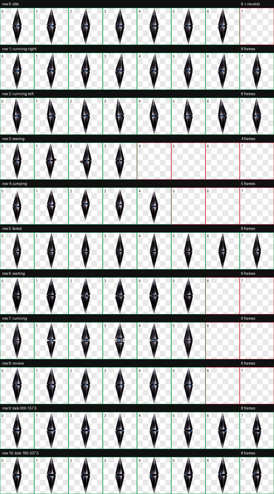

# Black Quartz — Codex Companion v2

[English README](README.en.md) · [安装说明](INSTALL.md) · [可用 Prompts](PROMPTS.zh-CN.md)



Black Quartz 是一个为 Codex 制作的非官方同人桌面 Companion。她没有动物形态，也不是传统意义上的吉祥物；她更像一种安静运行的协议实体。

主体由上下两枚细长、近乎实心的烟黑晶体棱柱构成。晶面吸收大部分光线，只留下克制的铅灰反射；中央狭缝中藏有一枚微小的冷蓝档案核心。平静时，她近乎闭合为一根悬浮的黑色双锥；处理任务时，晶体会展开内嵌结构与附着式权限刺；观察方向则由狭缝内蓝色孔径的位置表达，而不是靠眼睛或整个物体旋转。

## 视觉关键词

- 烟黑石英、黑曜石玻璃、深蓝黑、铅灰反射
- 冷蓝档案核心、狭窄中缝、克制折射
- 哥特科幻、档案协议、权限、秩序、安静
- 非动物、非拟人、非机械框架、非霓虹 UI

## 动画内容

该版本符合 Codex Pet v2 的 8×11 图集规范，包含：

- 9 种标准状态：静止、向右移动、向左移动、致意、跃迁、失败、等待、处理中、审阅完成
- 16 个顺时针观察方向
- 透明背景与边缘去色处理
- 独立方向盲测与最终视觉 QA

## 技术规格

- Sprite version：2
- 图集：1536×2288 WebP（RGBA）
- 单元格：192×208
- 布局：8 列 × 11 行
- 验证状态：通过，无错误、无警告

## 安装

将 [`pet/`](pet/) 文件夹内的两个文件复制到：

```text
~/.codex/pets/black-quartz/
├── pet.json
└── spritesheet.webp
```

随后重启 Codex；如果列表仍显示旧缓存，可先切换到其他宠物，再切回 Black Quartz。

## 预览与复现

- 动画预览：[`preview/`](preview/)
- 中文 Prompt：[`PROMPTS.zh-CN.md`](PROMPTS.zh-CN.md)
- English prompts: [`PROMPTS.en.md`](PROMPTS.en.md)
- QA 报告：[`qa/`](qa/)

## 分享说明

这是基于游戏原版“黑石英”视觉语言制作的非官方同人衍生作品，与原游戏开发商、发行商或权利方无隶属或背书关系。原角色与世界观相关权利归各自权利方所有。建议仅用于个人、非商业分享；公开再分发或商业使用前，请自行确认相关授权与平台规则。详见 [`RIGHTS-NOTICE.md`](RIGHTS-NOTICE.md)。
